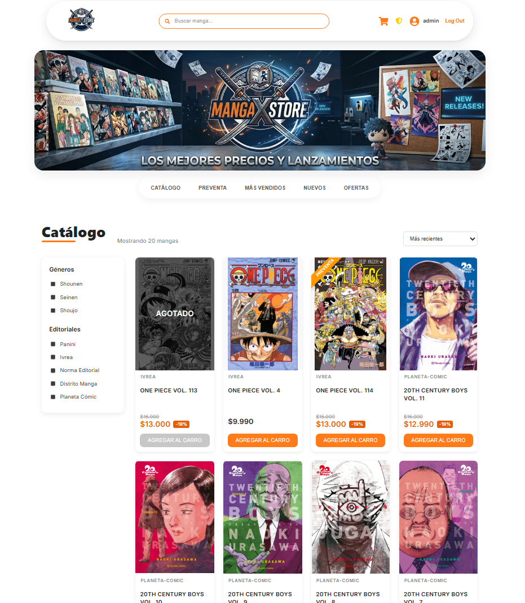
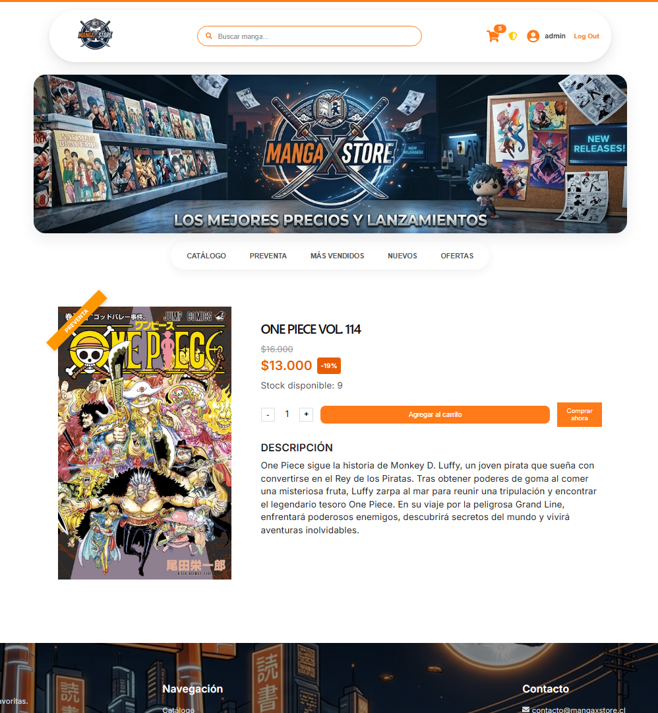
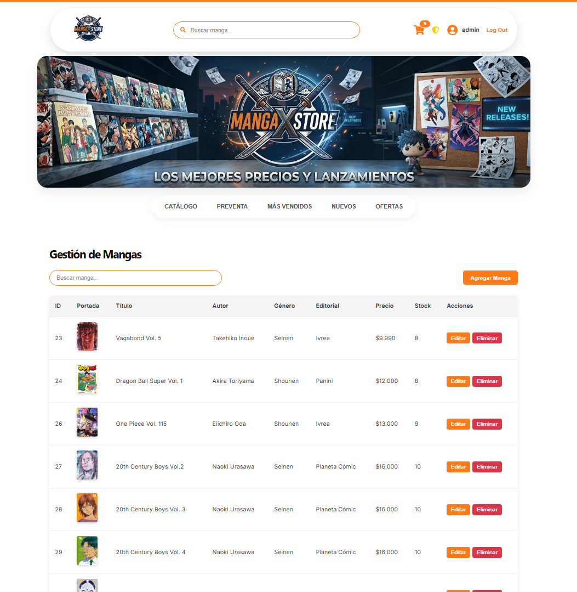

# 📚 Manga Store


Aplicación fullstack de e-commerce para la gestión y compra de mangas online. El proyecto simula el funcionamiento de una tienda digital, incluyendo catálogo de productos, búsqueda y filtros, carrito de compras, autenticación de usuarios, roles de cliente y administrador, control de stock y gestión de órdenes.

> 🚧 **Demo en vivo:** próximamente. Actualmente, el proyecto puede ejecutarse de forma local siguiendo los pasos de instalación indicados más abajo.

## Vista previa

### Catálogo


### Detalle Manga


### Panel de administración


## Funcionalidades

### Cliente

- Listado de mangas con paginación.
- Búsqueda de mangas por título.
- Filtros por género, editorial, preventa y ofertas.
- Visualización del detalle de cada manga.
- Carrito de compras.
- Creación de órdenes.
- Control de stock.
- Registro e inicio de sesión.
- Acceso a funcionalidades según el rol del usuario.

### Administrador

- CRUD completo de mangas.
- Creación, edición y eliminación de productos.
- Carga y gestión de imágenes de portada.
- Gestión de precios y stock.
- Gestión de preventas y ofertas.
- Buscador y paginación para la administración del catálogo.

## Tecnologías

**Frontend:** React · Vite · JavaScript · HTML · CSS

**Backend:** Java 17 · Spring Boot 3.2.5 · Spring Data JPA · Maven

**Base de datos:** MySQL 8

**Herramientas:** Git · GitHub · Postman

## Arquitectura

El proyecto está dividido principalmente en tres partes:

- **Frontend:** aplicación desarrollada con React y Vite, encargada de la interfaz, navegación, catálogo, carrito y comunicación con la API REST.
- **Backend:** API REST desarrollada con Spring Boot, encargada de la lógica de negocio, usuarios, mangas, órdenes, stock y acceso a los datos.
- **Base de datos:** MySQL, utilizada para almacenar la información de usuarios, mangas, órdenes y sus relaciones.

El frontend consume los endpoints proporcionados por el backend mediante HTTP, mientras que Spring Data JPA se encarga de la persistencia y comunicación entre el backend y MySQL.

## Decisiones de diseño

### Separación entre frontend y backend

El frontend y el backend se mantienen como aplicaciones independientes. React se encarga de la interfaz y experiencia del usuario, mientras que Spring Boot concentra la lógica de negocio y el acceso a los datos. Esta separación facilita el mantenimiento del proyecto y permite desplegar ambas aplicaciones de forma independiente.

### Gestión de imágenes

Actualmente las portadas de los mangas se almacenan localmente en la carpeta `uploads/mangas`. La base de datos almacena la ruta asociada a cada imagen, permitiendo que el backend las sirva al frontend.

Para un futuro despliegue público se contempla migrar el almacenamiento de imágenes a un servicio externo, evitando depender del sistema de archivos local del servidor.

### Gestión de stock

El stock de cada manga se mantiene en la base de datos y se actualiza al procesar las compras. Esto permite mantener sincronizada la disponibilidad de los productos con las órdenes realizadas.

### Roles de usuario

La aplicación diferencia entre usuarios normales y administradores. Las funcionalidades administrativas, como crear, editar o eliminar mangas, se encuentran separadas de las operaciones disponibles para los clientes.

## Requisitos previos

Para ejecutar el proyecto localmente necesitas:

- Node.js 18 o superior.
- Java 17 o superior.
- MySQL 8 o superior.
- Maven.

## Instalación y configuración

### 1. Clonar el repositorio

```bash
git clone https://github.com/pontanillafelipe/manga-store.git
cd manga-store
```

### 2. Configurar la base de datos

Crear una base de datos MySQL llamada `manga_store`:

```sql
CREATE DATABASE manga_store;
```

Luego importar el script incluido en el proyecto:

```bash
mysql -u tu_usuario -p manga_store < database/manga_store.sql
```

Este script contiene la estructura necesaria para ejecutar la aplicación y los datos iniciales del proyecto.

### 3. Configurar la conexión con MySQL

Abrir:

```text
manga-store/src/main/resources/application.properties
```

Configurar las credenciales correspondientes a la instalación local de MySQL:

```properties
spring.datasource.url=jdbc:mysql://localhost:3306/manga_store
spring.datasource.username=tu_usuario
spring.datasource.password=tu_contraseña
```

> Las credenciales dependen de cada instalación local y no deben incluirse credenciales personales en el repositorio.

### 4. Ejecutar el backend

Desde la carpeta del backend:

```bash
cd manga-store
mvn spring-boot:run
```

También puede ejecutarse utilizando Maven Wrapper si está incluido en el proyecto:

```bash
./mvnw spring-boot:run
```

En Windows:

```bash
mvnw.cmd spring-boot:run
```

El backend estará disponible en:

```text
http://localhost:8080
```

### 5. Ejecutar el frontend

En otra terminal:

```bash
cd manga-store-frontend
npm install
npm run dev
```

El frontend estará disponible en:

```text
http://localhost:5173
```

## Estructura del proyecto

```text
manga-store/
├── manga-store/              # Backend (Spring Boot)
│   ├── src/
│   │   └── main/
│   │       ├── java/
│   │       └── resources/
│   │           └── application.properties
│   └── pom.xml
│
├── manga-store-frontend/     # Frontend (React + Vite)
│   ├── src/
│   │   ├── components/
│   │   ├── pages/
│   │   └── context/
│   └── package.json
│
├── database/
│   └── manga_store.sql
│
├── uploads/
│   └── mangas/               # Imágenes locales de los mangas
│
├── docs/                     # Capturas utilizadas en este README
│
└── README.md
```

## Estado del proyecto

Manga Store es un proyecto fullstack desarrollado con el objetivo de aplicar e integrar tecnologías de frontend, backend y bases de datos en una aplicación completa.

Actualmente cuenta con catálogo de productos, búsqueda y filtros, carrito de compras, usuarios, roles, operaciones CRUD, gestión de stock, órdenes y persistencia mediante MySQL.

El proyecto funciona actualmente de forma local. Como siguientes etapas se contempla realizar su despliegue público, utilizar una base de datos alojada en la nube y migrar el almacenamiento de imágenes a un servicio externo.

## Próximas mejoras

- Despliegue público del frontend y backend.
- Migración de la base de datos a un servicio en la nube.
- Almacenamiento externo de imágenes.
- Mejoras en autenticación y seguridad.
- Validaciones adicionales en el proceso de compra.
- Mejoras generales de interfaz y experiencia de usuario.

## Autor

**Felipe Pontanilla**

[GitHub](https://github.com/pontanillafelipe)